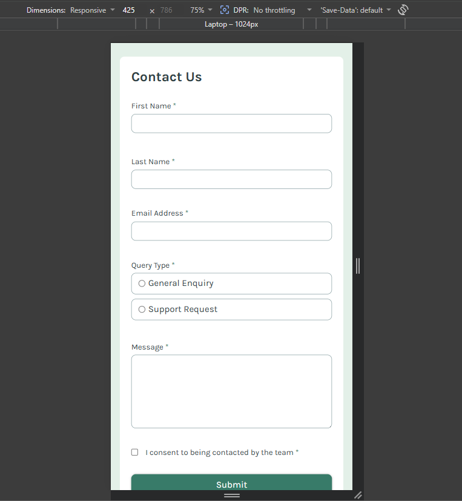
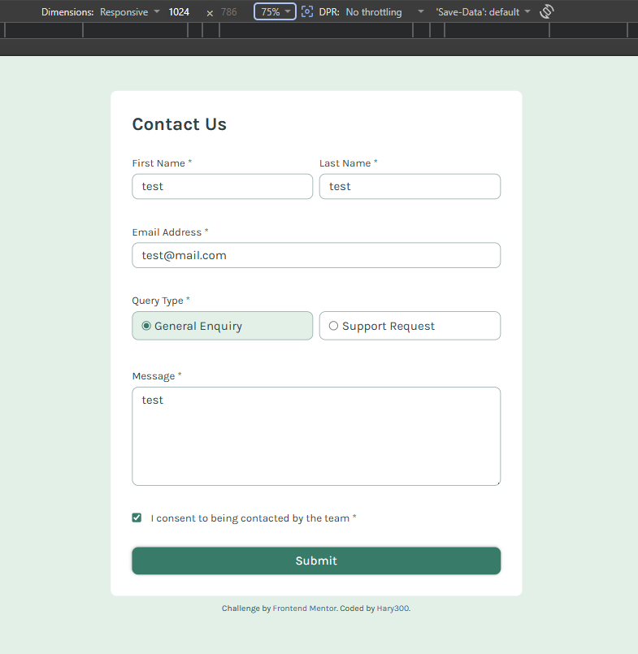

# Frontend Mentor - Contact form solution

This is a solution to the [Contact form challenge on Frontend Mentor](https://www.frontendmentor.io/challenges/contact-form--G-hYlqKJj).

## Table of contents

- [Overview](#overview)
  - [The challenge](#the-challenge)
  - [Screenshot](#screenshot)
  - [Links](#links)
- [My process](#my-process)
  - [Built with](#built-with)
  - [What I learned](#what-i-learned)

## Overview

### The challenge

Users should be able to:

- Complete the form and see a success toast message upon successful submission
- Receive form validation messages if:
  - A required field has been missed
  - The email address is not formatted correctly
- Complete the form only using their keyboard
- Have inputs, error messages, and the success message announced on their screen reader
- View the optimal layout for the interface depending on their device's screen size
- See hover and focus states for all interactive elements on the page

### Screenshot

### Links

- Solution URL: (https://github.com/Hary300/Frontendmentor-Project-14-Contact-Form.git)
- Live Site URL: (https://frontendmentor-project-14-contact-f.vercel.app)

## My process

### Built with

- Semantic HTML5 markup
- CSS custom properties
- tailwind
- Flexbox
- CSS Grid
- Mobile-first workflow
- express
- zod
- mongoose

## What I Learned

- Building and handling form submissions using Express.js.
- Validating user input before storing data.
- Connecting a backend application to MongoDB with Mongoose.
- Creating API endpoints for sending and retrieving messages.
- Managing asynchronous database operations using async/await.
- Implementing error handling and proper HTTP status codes.
- Structuring a backend project using routes, controllers, and models.

This project gave me a better understanding of backend development fundamentals and how data is processed and stored in a web application.
